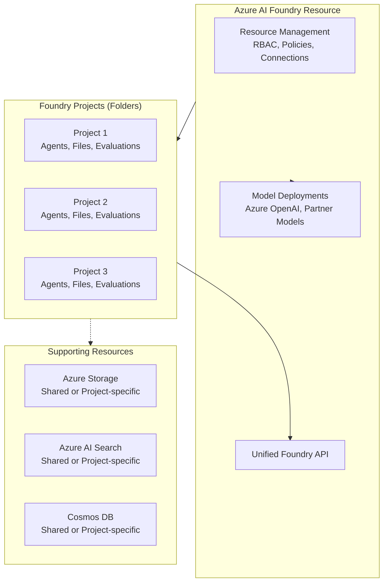
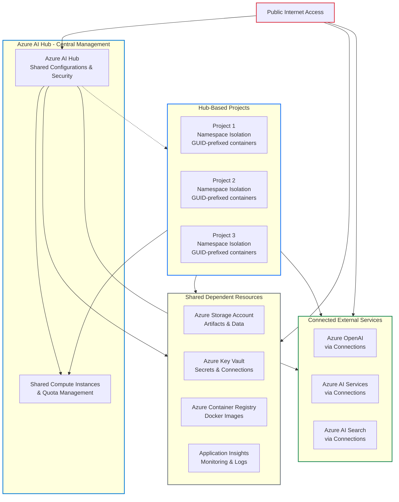

# AI Foundry Deployment Model Update

## Overview
Azure AI Foundry is transitioning to a unified platform-as-a-service offering, evolving from the legacy **hub-based** model to a **project-centric** approach. This change is designed to provide greater flexibility, improved resource management, and enhanced scalability for your AI workloads.

The project-centric model aligns with Azure AI Foundry's unified platform-as-a-service offering, delivering enterprise-grade infrastructure with streamlined management through unified Role-based access control (RBAC), networking, and policies under one Azure resource provider namespace.

Azure AI Foundry brings together agents, models, and tools under unified governance—enabling fine-grained cost tracking, unified RBAC, consistent networking and policy management, and centralized audit logging for all models and agents in one place. Previously, while resources were centrally connected and made available to projects, behind-the-scenes management was fragmented across multiple services causing fragmentation of RBAC, cost, and policy management.

---

## What's Changing?

### Legacy Hub-Based Model
Previously, deployments were managed centrally via an Azure AI Hub resource. Azure OpenAI and AI Services were connected to the hub so projects could use them, but deployments were managed on the individual Azure OpenAI and AI Services resources. This caused fragmentation of RBAC, cost, and policy management across multiple services. The hub provided:
- Centralized resource connections and configurations
- Hub-level security settings that cascade to projects
- Shared infrastructure with namespace isolation
- Dependency on Azure Machine Learning infrastructure for certain capabilities
- Fragmented management across up to 5 different Azure services behind the scenes

### New Project-Centric Model (Foundry Projects)
Each project is now managed through an **Azure AI Foundry resource** with unified governance. This provides:
- **Unified Resource Management:** Agents, models, and tools managed together under one Azure resource provider
- **Native Agent Support:** Full support for Azure AI Agent Service with general availability
- **Unified API Access:** Native support for Azure AI Foundry API to work with agents and across models
- **Project-Level Organization:** Projects act as folders to organize work within the resource context
- **Simplified Governance:** Centralized RBAC, cost tracking, and policy management
- **Enhanced Model Access:** Direct access to models sold by Azure (Azure OpenAI, DeepSeek, xAI) and Partner & Community models through Marketplace

---

## Why Migration Is Required

**Important Clarification:** You do **not** need to redeploy your Azure AI Foundry resource itself. If you already have an Azure AI Foundry resource (formerly called "AI Services"), you can continue using it. You can also keep existing artifacts like model deployments.

However, to access the latest capabilities and unified governance model, you **must create new projects** within your Azure AI Foundry resource. Here's what needs to be created or migrated:

### 1. Project Creation Requirements
- **New Foundry Projects:** Must be created within your existing or new Azure AI Foundry resource
- **Agent Recreation:** Any existing agents must be recreated and re-run in the new project structure
- **Project-Level Capabilities:** For network-secured Standard Agent setups, supporting resources (CosmosDB, Search, Storage) can be:
  - Shared at the parent resource level across projects
  - Overridden at the individual project level
  - Managed exclusively at the project level
- **Data Isolation:** In all configurations, data isolation is maintained at the container level

### 2. Architecture Migration Benefits
The transition addresses several key improvements:

#### Unified Governance Model
- **Centralized Management:** Previously fragmented management across 5 services is now unified
- **RBAC Consolidation:** Role-based access control is now managed consistently under one namespace
- **Cost Tracking:** Fine-grained cost analysis for models and agents in one place
- **Policy Management:** Consistent networking and policy management across all components

#### API and SDK Modernization
- **Project Endpoints:** The Azure AI Agent Service uses project endpoints instead of connection strings
- **SDK Compatibility:** Current SDK versions support the new project-centric endpoint model
- **Unified API:** Azure AI Foundry API provides consistent contracts across model providers

### 3. What Can Be Preserved
- **Existing Model Deployments:** Azure OpenAI and other model deployments can be reused
- **Data Files:** Project files and artifacts can be migrated
- **Fine-tuned Models:** Custom models can be carried forward
- **Vector Stores:** Existing vector stores can be accessed
- **Connections:** Resource connections can be recreated (not automatically migrated)

---

## Architecture Comparison

### Legacy Hub-Based Model vs. Current Project-Centric Model

The core difference between the two models is **fragmented management** (legacy) versus **unified governance** (project-centric):

| Aspect                | Legacy Hub-Based Model                                 | Project-Centric Model (Current)                |
|-----------------------|-------------------------------------------------------|------------------------------------------------|
| **Resource Management** | Azure OpenAI/AI Services connected to hub<br>Deployments managed on individual services<br>Fragmented across ~5 services | Unified management under Azure AI Foundry resource<br>Agents, models, tools managed together |
| **Governance**         | Fragmented RBAC/cost/policy across services           | Centralized RBAC, cost tracking, policy management |
| **Project Organization** | Projects inherit from hub configurations               | Projects as folders within resource context    |
| **API Access**        | Connection strings and multiple service endpoints      | Unified Azure AI Foundry API with project endpoints |
| **Agent Support**     | Preview agents with limited capabilities               | General availability with full feature set    |
| **Data Isolation**    | Namespace isolation within shared resources           | Container-level isolation with flexible resource sharing options |

> **Summary:**  
> The legacy model required managing multiple Azure services with fragmented governance, while the project-centric model provides unified management and governance under a single Azure AI Foundry resource.

## Key Components of the Project-Centric Architecture

### Current Project-Centric Model

The project-centric model provides unified management through Azure AI Foundry resource with flexible resource sharing options.



**Legacy Hub-Based Model Architecture**



**Key Characteristics of the Legacy Hub-Based Model:**

- **Centralized Management:** Azure AI Hub acts as the central control point for all projects
- **Shared Infrastructure:** All projects share the same dependent resources (Storage, Key Vault, Container Registry, Application Insights)
- **Namespace Isolation:** Projects are isolated within shared resources using GUID-prefixed containers and naming conventions
- **Shared Compute:** Compute instances and quota are managed at the hub level and shared across projects
- **Hub-Level Security:** Security settings, networking, and policies cascade from hub to all projects
- **Connection-Based External Access:** External services like Azure OpenAI and AI Search are accessed via shared connections
- **Public Internet Access:** Resources are accessible from the public internet unless explicitly configured otherwise
- **Shared Credentials:** Connections store shared credentials in Key Vault for implicit access across projects


### Core Infrastructure Components

#### 1. Azure AI Foundry Resource
- **Primary Resource:** The foundational resource that provides unified access to agents, models, and Azure OpenAI services
- **Unified Management:** Single resource for managing projects, deployments, and connections
- **Flexible Networking:** Supports both public and private network configurations
- **Resource Provider:** Built on `Microsoft.CognitiveServices` for consistent governance and policy management

#### 2. Project-Level Organization
Projects act as organizational folders within the Azure AI Foundry resource:

**Project Capabilities**
- Agent development and management
- File storage and organization  
- Evaluation workflows
- Model access and usage
- Container-level data isolation

**Supporting Resources (Flexible Configuration)**
For Standard Agent setups, supporting resources can be configured flexibly:

**Azure Storage Account**
- **Shared Configuration:** Resource-level storage shared across all projects
- **Project-Specific:** Dedicated storage per project for enhanced isolation
- **Hybrid Approach:** Override shared configuration at individual project level

**Azure AI Search**
- **Shared Configuration:** Central search service accessible to all projects
- **Project-Specific:** Dedicated search instances for sensitive workloads
- **Use Case Driven:** Choose based on data sensitivity and performance requirements

**Azure Cosmos DB for NoSQL**
- **Shared Configuration:** Central database with container-level isolation
- **Project-Specific:** Dedicated database instances for compliance requirements
- **Data Isolation:** All configurations maintain data separation at container level

#### 3. Network Architecture (Optional Private Deployment)

For organizations requiring private networking, the following components are available:

**Virtual Network Configuration (When Using Private Networking)**
- Two dedicated subnets required:
  - **Private endpoint subnet** (for all private endpoints)
  - **Agent injection subnet** (with `Microsoft.App/environments` delegation)
- **Agent subnet exclusivity:** Each Azure AI Foundry resource must use a dedicated agent subnet

**Private Endpoint Configuration (When Using Private Networking)**
- Azure AI Foundry resource private endpoint
- Storage account private endpoints (blob and file) 
- Azure AI Search private endpoint
- Cosmos DB private endpoint
- All resources must be in the same Azure region as the virtual network

### Security and Access Control

#### 1. Network Security (Optional Private Configuration)
- **Flexible Access:** Supports both public internet access and private network configurations
- **Private Network Option:** Complete network isolation for enhanced security
- **Zero Trust Architecture:** Optional deployment with no public internet access
- **Network Injection:** Available for Standard Agents requiring private connectivity

#### 2. Access Methods
**Public Access (Default)**
- Direct internet access to Azure AI Foundry portal and APIs
- Standard authentication via Microsoft Entra ID
- API key authentication supported for simplified integration

**Private Access (Optional)**
For organizations requiring private networking:
- **Azure Bastion:** Jump box VM within the virtual network
- **VPN Gateway:** Point-to-site or site-to-site VPN connections
- **ExpressRoute:** Private connection from on-premises networks

#### 3. Identity and Authentication
- **Managed Identity Support:** System-assigned or user-assigned managed identities
- **Azure RBAC:** Fine-grained role-based access control at resource and project levels
- **API Key Authentication:** Optional for simplified integration scenarios
- **Microsoft Entra ID Integration:** Centralized identity management with passthrough authentication options

---

## Migration Steps

### 1. Assess Current Environment
- **Resource Inventory:** Identify your existing Azure AI Foundry resource (formerly "AI Services")
- **Model Deployments:** Document existing Azure OpenAI and model deployments (these can be reused)
- **Agent Inventory:** List current agents that will need to be recreated
- **Connection Mapping:** Document current connections to external services and data sources

### 2. Locate Your Azure AI Foundry Resource
Most organizations already have an Azure AI Foundry resource. If you don't have one:
- **Create AI Foundry Resource:** Deploy a new Azure AI Foundry resource in your desired region
- **Connect Existing Services:** Link your existing Azure OpenAI resources via connections
- **Preserve Deployments:** Existing model deployments can continue to be used

### 3. Create New Foundry Projects
Projects are organizational folders within your Azure AI Foundry resource:
- **Project Creation:** Create projects for each use case or application
- **Resource Configuration:** Choose resource sharing approach:
  - **Shared Resources:** Use resource-level storage, search, and Cosmos DB across projects
  - **Project-Specific:** Dedicated resources per project for enhanced isolation
  - **Hybrid:** Override shared settings at project level as needed

### 4. Configure Supporting Resources (For Standard Agents)
**Flexible Resource Configuration Options:**

**Option A: Shared Resource Model**
- Single Azure Storage account shared across all projects
- Centralized Azure AI Search service
- Shared Cosmos DB with container-level data isolation

**Option B: Project-Specific Model**  
- Dedicated Azure Storage per project
- Individual Azure AI Search instances per project
- Separate Cosmos DB instances for strict compliance

**Option C: Hybrid Model**
- Start with shared resources
- Override with project-specific resources where needed
- Maintain container-level data isolation in all configurations

```bash
# Clone this repository
git clone https://github.com/JinLee794/ai-foundry-sandbox.git
cd ai-foundry-sandbox

# Configure your deployment parameters
# Edit infra/bicep/examples/private-foundry.test.bicepparam with your specific settings

# Deploy the Bicep template for private networking
az deployment group create \
  --resource-group <your-resource-group> \
  --template-file infra/bicep/private-foundry.bicep \
  --parameters infra/bicep/examples/private-foundry.test.bicepparam
```

**Template Configuration (`private-foundry.test.bicepparam`):**
```bicep
// AI Account Configuration
param accountName = 'your-aifoundry-account'
param location = 'eastus2'

// Model Configuration  
param modelName = 'gpt-4o'
param modelFormat = 'OpenAI'
param modelVersion = '2024-08-06'
param modelSkuName = 'GlobalStandard'
param modelCapacity = 10

// Network Configuration
param virtualNetworkName = 'ai-foundry-private-vnet'
param virtualNetworkAddressPrefix = '10.0.0.0/16'
param agentSubnetAddressPrefix = '10.0.1.0/24'
param privateEndpointSubnetAddressPrefix = '10.0.2.0/24'

// Project Configuration
param projectName = 'your-project-name'
param projectCapHost = 'your-capability-host'

// Unique suffix for resource naming
param uniqueSuffix = 'prod001'
```

**Key Template Features:**
- **Network Infrastructure:** Creates VNet with dedicated subnets for agent injection (`Microsoft.App/environments` delegation) and private endpoints
- **AI Foundry Account:** Deploys Azure AI Foundry resource with network injection enabled and public access disabled
- **Model Deployment:** Automated GPT-4o model deployment with configurable capacity
- **Project Creation:** Sets up AI Foundry project with network-secured configuration
- **Capability Host Setup:** Configures project capability host for bring-your-own-resource scenarios
- **System-Assigned Identity:** Enables managed identity for secure Azure resource access

**Template Architecture:**

The Bicep template follows a modular architecture with the following components:

- **`private-foundry.bicep`** - Main orchestration template
- **`foundry/network.bicep`** - VNet and subnet configuration with proper delegations
- **`foundry/ai-account-identity.bicep`** - AI Foundry account with network injection
- **`foundry/ai-project-identity.bicep`** - Project creation and configuration
- **`foundry/add-project-capability-host.bicep`** - Capability host setup for external resources

**Prerequisites:**
- Target resource group must exist
- Virtual network (if existing) must be in the same region as AI Foundry resources
- Required Azure resource providers must be registered in your subscription

### 6. Recreate Connections and Agents
- **Connection Recreation:** Manually recreate connections to external data sources and services
- **Agent Migration:** Recreate agents using the new Azure AI Foundry SDK with project endpoints
- **Code Updates:** Update applications to use project endpoints instead of connection strings
- **SDK Upgrade:** Install latest SDK versions for project-centric model support

### 7. Data and Workload Migration
- **Model Deployments:** Existing Azure OpenAI deployments can be reused via connections
- **File Migration:** Upload project files to new project storage
- **Agent Recreation:** Preview agents must be manually recreated (no direct upgrade path)
- **Thread Data:** Agent threads and messages require manual migration if needed

### 8. Validation and Testing
- **Functionality Testing:** Verify all agent operations and model access
- **Connection Validation:** Test connections to external data sources
- **Performance Verification:** Ensure expected performance characteristics
- **Security Testing:** Validate access controls and data isolation

### 9. Clean Up Legacy Resources (Optional)
- **Hub Assessment:** Evaluate if hub-based projects are still needed for unsupported features
- **Resource Cleanup:** Remove unused hub-based projects following proper sequence
- **Cost Optimization:** Monitor and optimize costs across new project structure

---

## Important Considerations

### Resource Preservation
- **No Resource Redeployment Required:** Existing Azure AI Foundry resources can be reused
- **Model Deployment Continuity:** Azure OpenAI and other model deployments can continue operating
- **Connection Flexibility:** You may connect to models deployed in different regions via connections
- **Incremental Migration:** Move to new projects gradually while maintaining existing deployments

### Project Creation Requirements
- **New Projects Only:** Must create new Foundry projects to access latest capabilities
- **Agent Recreation:** Existing agents need to be recreated in new projects (no automatic migration)
- **Resource Flexibility:** Choose shared, project-specific, or hybrid resource configurations
- **Data Isolation:** Container-level isolation maintained in all resource sharing models

### Regional and Deployment Considerations
- **Regional Flexibility:** Azure AI Foundry resources can connect to models in different regions
- **Deployment Methods:** Projects support multiple deployment approaches (portal, CLI, SDK, Bicep)
- **Private Networking:** Network-secured environments require Bicep template deployment
- **Agent Types:** Standard Agents (with private networking) vs. basic agents (public access)

### Cost Implications
- **Resource Sharing Flexibility:** Choose cost model based on sharing vs. isolation requirements
- **Shared Resources:** Lower costs with resource-level sharing across projects  
- **Project-Specific Resources:** Higher isolation with dedicated resources per project
- **Private Networking:** Additional costs for private endpoints and network infrastructure when required
- **Cosmos DB Considerations:** Throughput costs vary by configuration (shared vs. dedicated)

---

## Documentation and References

### Official Microsoft Documentation
- **[Azure AI Foundry Planning Guide](https://learn.microsoft.com/en-us/azure/ai-foundry/concepts/planning)** - Comprehensive organizational rollout and planning guidance
- **[Azure AI Foundry Architecture](https://learn.microsoft.com/en-us/azure/ai-foundry/concepts/architecture)** - Complete architectural overview and computing infrastructure  
- **[Project Migration Guide](https://learn.microsoft.com/en-us/azure/ai-foundry/how-to/migrate-project?tabs=azure-ai-foundry)** - Step-by-step migration from hub-based to Foundry projects
- **[Azure AI Foundry Resource Creation (Terraform)](https://learn.microsoft.com/en-us/azure/ai-foundry/how-to/create-resource-terraform)** - Infrastructure as code deployment options
- **[Build Recap: New Azure AI Foundry Resource](https://techcommunity.microsoft.com/blog/AIPlatformBlog/build-recap-new-azure-ai-foundry-resource-developer-apis-and-tools/4427241)** - Product announcements and new capabilities
- **[Azure AI Foundry Private Link Configuration](https://learn.microsoft.com/en-us/azure/ai-foundry/how-to/configure-private-link?pivots=fdp-project)** - Comprehensive guide for configuring private networking
- **[Network-Secured Agent Service](https://learn.microsoft.com/en-us/azure/ai-foundry/agents/how-to/virtual-networks)** - Detailed instructions for private network agent deployment
- **[Project Types Comparison](https://learn.microsoft.com/en-us/azure/ai-foundry/what-is-azure-ai-foundry#types-of-projects)** - Detailed comparison between Foundry and hub-based projects

### Infrastructure Templates and Samples
- **[Official Infrastructure Samples](https://github.com/azure-ai-foundry/foundry-samples/tree/main/samples/microsoft/infrastructure-setup)** - Complete repository of Bicep templates for various configurations
- **[Private Network Standard Setup](https://github.com/azure-ai-foundry/foundry-samples/tree/main/samples/microsoft/infrastructure-setup/15-private-network-standard-agent-setup)** - Specific template for private networking deployment
- **[Terraform Configuration (Uses AzAPI; AzureRM provider currently does not support)](https://github.com/azure-ai-foundry/foundry-samples/tree/main/samples/microsoft/infrastructure-setup-terraform/15b-private-network-standard-agent-setup-byovnet)** - Alternative Terraform deployment option

### Security and Networking Guidelines
- **[Secure Networking for Azure AI Platform](https://learn.microsoft.com/en-us/azure/cloud-adoption-framework/scenarios/ai/platform/networking)** - Best practices for AI platform networking
- **[Private Endpoints for Azure Services](https://learn.microsoft.com/en-us/azure/private-link/private-endpoint-overview)** - General guidance on private endpoint implementation
- **[Azure AI Foundry RBAC](https://learn.microsoft.com/en-us/azure/ai-foundry/concepts/rbac-azure-ai-foundry)** - Role-based access control configuration

### Migration and Planning Resources
- **[Azure AI Foundry Organizational Rollout](https://learn.microsoft.com/en-us/azure/ai-foundry/concepts/planning)** - Enterprise deployment planning guide
- **[Bring Your Own Resources](https://learn.microsoft.com/en-us/azure/ai-foundry/agents/how-to/use-your-own-resources)** - Guide for using existing Azure resources
- **[Cost Management and Planning](https://learn.microsoft.com/en-us/azure/ai-foundry/how-to/costs-plan-manage)** - Cost optimization strategies

### Architecture Diagrams and Visual References
- **[Network Isolation Architecture](https://learn.microsoft.com/en-us/azure/ai-foundry/media/how-to/network/network-diagram-agents.png)** - Complete network architecture diagram
- **[Network Injection Diagram](https://learn.microsoft.com/en-us/azure/ai-foundry/media/how-to/network/network-injection.png)** - Agent service network injection visualization
- **[Baseline Chat Architecture](https://learn.microsoft.com/en-us/azure/architecture/ai-ml/architecture/baseline-azure-ai-foundry-chat)** - Reference architecture for chat applications

---

## Support and Assistance

### Getting Help
- **Microsoft Documentation:** Comprehensive guides and API references available at [Microsoft Learn](https://learn.microsoft.com/en-us/azure/ai-foundry/)
- **GitHub Samples:** Community-driven examples and templates in the [Azure AI Foundry Samples](https://github.com/azure-ai-foundry/foundry-samples) repository
- **Azure Support:** For deployment issues and technical assistance, contact your Azure support representative

### Known Issues and Limitations
- **Project Creation Required:** New projects must be created to access latest capabilities - no automatic upgrade
- **Agent Recreation:** Existing agents must be manually recreated (no direct migration path)
- **Connection Recreation:** Connections to external services must be manually recreated
- **Feature Parity:** Some features may still require hub-based projects (see [feature comparison](https://learn.microsoft.com/en-us/azure/ai-foundry/what-is-azure-ai-foundry#which-type-of-project-do-i-need))
- **Private Networking:** Network-secured environments require Bicep template deployment
- **SDK Updates:** Latest SDK versions required for project endpoint support

### Best Practices
- **Testing:** Always deploy in a development environment first to validate configurations
- **Backup:** Ensure comprehensive backup of existing data before beginning migration
- **Monitoring:** Implement Azure Monitor and Application Insights for ongoing observability
- **Documentation:** Maintain detailed documentation of your specific configuration choices

---

For questions or technical assistance with your migration, please contact your support representative or consult the official [Azure AI Foundry documentation](https://learn.microsoft.com/en-us/azure/ai-foundry/).
