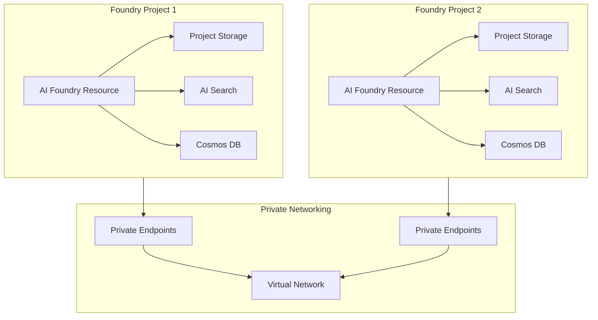
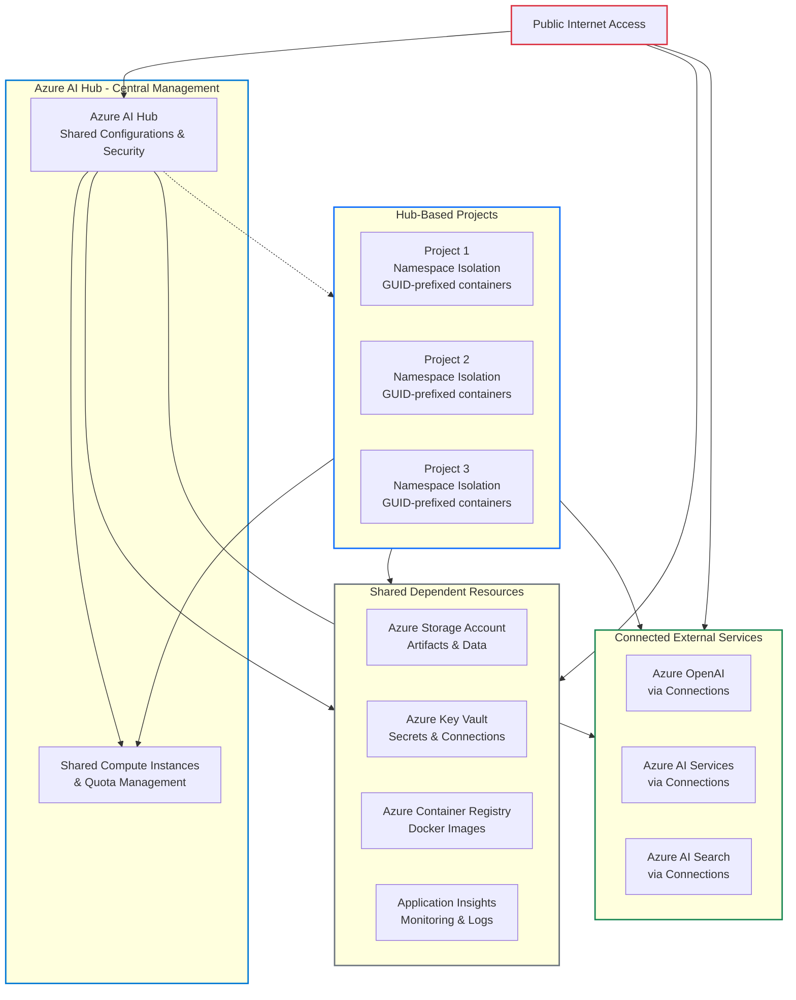

# AI Foundry Deployment Model Update

## Overview
AI Foundry is evolving its deployment architecture. We are moving away from the legacy **hub-based** model to a **project-centric** approach. This change is designed to provide greater flexibility, improved resource isolation, and enhanced scalability for your AI workloads.

The project-centric model aligns with Azure AI Foundry's unified platform-as-a-service offering, delivering enterprise-grade infrastructure with streamlined management through unified Role-based access control (RBAC), networking, and policies under one Azure resource provider namespace.

We are bringing this together to meet central governance requirements for models and agents—enabling fine-grained cost tracking, unified RBAC, consistent networking and policy management, and centralized audit logging for all models and agents in one place.

---

## What's Changing?

### Legacy Hub-Based Model
Previously, deployments were managed centrally via an Azure AI Hub resource. All projects and capabilities were provisioned under this hub, with:
- Shared configurations across multiple projects
- Hub-level security settings that cascade to projects
- Centralized resource management and connections
- Dependency on Azure Machine Learning infrastructure for certain capabilities

### New Project-Centric Model (Foundry Projects)
Each project is now deployed and managed independently with an **Azure AI Foundry resource** as the foundation. This provides:
- **Independent Project Management:** Each project operates with its own Azure AI Foundry resource
- **Native Agent Support:** Full support for Azure AI Agent Service with general availability
- **Unified API Access:** Native support for Azure AI Foundry API to work with agents and across models
- **Project-Level Isolation:** Files, threads, and outputs are isolated at the project level
- **Direct Resource Provisioning:** Capabilities are provisioned directly at the project level
- **Enhanced Model Access:** Direct access to models sold by Azure (Azure OpenAI, DeepSeek, xAI) and Partner & Community models through Marketplace

---

## Why Redeployment Is Required

If you have previously deployed AI Foundry using the hub-based model, you **must redeploy** using the new project-centric model. This is a fundamental architectural change that cannot be upgraded in-place due to several critical factors:

### 1. Network Injection Requirements
The new project-centric model introduces **network injection** capabilities that require infrastructure-level changes:
- **Container Injection:** The platform network hosts APIs and injects subnets into your virtual network for local communication
- **Agent Service Integration:** Network-secured Standard Agents support full network isolation through network injection of the Agent client into your Azure virtual network
- **Subnet Delegation:** Requires dedicated subnet delegation to `Microsoft.App/environments` that cannot be updated after deployment

### 2. Private Networking Architecture
The project-centric model mandates a fully private networking configuration:
- **Account-Level Network Injection:** Network security is implemented at the Azure AI Foundry account level
- **End-to-End Network Isolation:** Complete isolation from public internet with private endpoints for all components
- **Subnet Requirements:** Specific subnet configurations with IP ranges under `172.16.0.0/12` or `192.168.0.0/16`

### 3. Project-Level Capabilities
Capabilities are now provisioned and managed at the individual project level:
- **Azure Storage Account:** Dedicated storage for project files and artifacts
- **Azure AI Search:** Search capabilities provisioned per project for RAG scenarios
- **Azure Cosmos DB:** Thread and message storage for Agent service
- **Resource Isolation:** Each project maintains its own set of dependencies

### 4. Infrastructure Dependencies
The new model requires specific infrastructure components that are incompatible with hub-based deployments:
- **Bicep Template Deployment:** Network-secured environments are only supported through Bicep template deployment
- **Private DNS Zones:** Requires specific private DNS zone configurations for each service type
- **Private Endpoints:** Dedicated private endpoints for Azure AI Foundry, Storage, AI Search, and Cosmos DB resources

### 5. API and SDK Changes
The Azure AI Agent Service in Azure AI Foundry uses project endpoints instead of connection strings:
- **Endpoint Migration:** Move from hub-based connection strings to project-based endpoints
- **SDK Compatibility:** Current SDK versions support the new project-centric endpoint model
- **Authentication Model:** Updated authentication mechanisms for project-centric access

---

## Architecture Comparison

### Legacy Hub-Based Model vs. Current Project-Centric Model

The core difference between the two models is **resource sharing** (legacy) versus **complete isolation** (project-centric):

| Aspect                | Legacy Hub-Based Model                                 | Project-Centric Model (Current)                |
|-----------------------|-------------------------------------------------------|------------------------------------------------|
| **Resource Management** | Centralized via Azure AI Hub<br>Shared infrastructure (storage, key vault, registry, AI Search, Cosmos DB) | Each project has its own dedicated resources (storage, AI Search, Cosmos DB, private endpoints) |
| **Isolation**         | Namespace isolation within shared resources           | Full resource and network isolation per project |
| **Access**            | Public internet access to hub and resources           | Private network only (VPN/ExpressRoute/Bastion required) |
| **Networking**        | Shared virtual network (if any)                       | Dedicated private virtual network per project   |
| **Security**          | Hub-level security cascades to projects               | Project-level security and RBAC                |
| **Scalability**       | Limited by shared infrastructure                      | Independent scaling per project                |

> **Summary:**  
> The legacy model pools resources for all projects under a single hub, while the project-centric model provisions a fully isolated, secure, and independently managed environment for each project.

## Key Components of the Project-Centric Architecture

### Current Project-Centric Model

The project-centric model provides dedicated resources for each project with full network isolation and independent scaling.



**Legacy Hub-Based Model Architecture**



**Key Characteristics of the Legacy Hub-Based Model:**

- **Centralized Management:** Azure AI Hub acts as the central control point for all projects
- **Shared Infrastructure:** All projects share the same dependent resources (Storage, Key Vault, Container Registry, Application Insights)
- **Namespace Isolation:** Projects are isolated within shared resources using GUID-prefixed containers and naming conventions
- **Shared Compute:** Compute instances and quota are managed at the hub level and shared across projects
- **Hub-Level Security:** Security settings, networking, and policies cascade from hub to all projects
- **Connection-Based External Access:** External services like Azure OpenAI and AI Search are accessed via shared connections
- **Public Internet Access:** Resources are accessible from the public internet unless explicitly configured otherwise
- **Shared Credentials:** Connections store shared credentials in Key Vault for implicit access across projects


### Core Infrastructure Components

#### 1. Azure AI Foundry Resource
- **Primary Resource:** The foundational resource that provides access to agent services, models, and Azure OpenAI services
- **Unified Management:** Single resource for managing projects, deployments, and connections
- **Network Isolation:** Supports private endpoints with DNS zones `privatelink.cognitiveservices.azure.com`, `privatelink.openai.azure.com`, and `privatelink.services.ai.azure.com`

#### 2. Project-Level Capabilities
Each project requires its own set of dedicated resources:

**Azure Storage Account**
- Stores project files, artifacts, and agent data
- Requires both `blob` and `file` private endpoints
- Private DNS zone: `privatelink.blob.core.windows.net`
- Supports Microsoft-managed or customer-managed encryption keys

**Azure AI Search**
- Provides search capabilities for RAG (Retrieval-Augmented Generation) scenarios
- Enables semantic search and vector search capabilities
- Private DNS zone: `privatelink.search.windows.net`
- Connects to projects via secure connections

**Azure Cosmos DB for NoSQL**
- Stores agent threads, messages, and conversation history
- Minimum throughput requirement: 3000 RU/s total
- Three containers provisioned per project (1000 RU/s each)
- Private DNS zone: `privatelink.documents.azure.com`
- Built on DiskANN for efficient vector search

#### 3. Network Architecture Requirements

**Virtual Network Configuration**
- Two dedicated subnets required:
  - **Private endpoint subnet** (for all private endpoints)
  - **Agent injection subnet** (with `Microsoft.App/environments` delegation)
- IP address ranges must be within `172.16.0.0/12` or `192.168.0.0/16`
- **Agent subnet exclusivity:** Each Azure AI Foundry resource must use a dedicated agent subnet - the agent subnet cannot be shared between multiple AI Foundry resources

**Private Endpoint Configuration**
- Azure AI Foundry resource private endpoint
- Storage account private endpoints (blob and file)
- Azure AI Search private endpoint
- Cosmos DB private endpoint
- All resources must be in the same Azure region as the virtual network

**DNS Configuration**
- Private DNS zones for each service type
- Conditional forwarders to Azure DNS Virtual Server (168.63.129.16)
- Integration with existing DNS infrastructure

### Security and Access Control

#### 1. Network Security
- **Public Network Access:** All resources configured with Public Network Access (PNA) disabled
- **Zero Trust Architecture:** No public internet access to any component
- **Network Isolation:** Complete traffic isolation within virtual network boundaries
- **Data Exfiltration Protection:** Network injection prevents unauthorized data movement

#### 2. Access Methods
Secure access to the private AI Foundry environment requires one of:
- **Azure Bastion:** Jump box VM within the virtual network
- **VPN Gateway:** Point-to-site or site-to-site VPN connections
- **ExpressRoute:** Private connection from on-premises networks

#### 3. Identity and Authentication
- **Managed Identity Support:** System-assigned or user-assigned managed identities
- **Azure RBAC:** Fine-grained role-based access control
- **API Key Authentication:** Optional for simplified integration scenarios
- **Microsoft Entra ID Integration:** Centralized identity management

---

## Migration Steps

### 1. Review Existing Deployments
- **Inventory Assessment:** Identify all current hub-based AI Foundry deployments
- **Data Mapping:** Document existing connections, models, and data dependencies
- **Dependency Analysis:** Map out all Azure resources and their relationships
- **Access Patterns:** Document current user access methods and requirements

### 2. Prepare Infrastructure Requirements
- **Network Planning:** Design virtual network architecture with required subnets
- **Resource Planning:** Plan Azure regions for all components (must be co-located)
- **DNS Strategy:** Plan private DNS zone integration with existing infrastructure
- **Security Review:** Validate private endpoint and firewall configurations

### 3. Deploy Using Bicep Templates (WIP)
The project-centric model with network isolation is **only supported through Bicep template deployment**. This repository provides a complete Bicep template for deploying a private AI Foundry environment:

```bash
# Clone this repository
git clone https://github.com/JinLee794/ai-foundry-sandbox.git
cd ai-foundry-sandbox

# Configure your deployment parameters
# Edit infra/bicep/examples/private-foundry.test.bicepparam with your specific settings

# Deploy the Bicep template
az deployment group create \
  --resource-group <your-resource-group> \
  --template-file infra/bicep/private-foundry.bicep \
  --parameters infra/bicep/examples/private-foundry.test.bicepparam
```

**Template Configuration (`private-foundry.test.bicepparam`):**
```bicep
// AI Account Configuration
param accountName = 'your-aifoundry-account'
param location = 'eastus2'

// Model Configuration  
param modelName = 'gpt-4o'
param modelFormat = 'OpenAI'
param modelVersion = '2024-08-06'
param modelSkuName = 'GlobalStandard'
param modelCapacity = 10

// Network Configuration
param virtualNetworkName = 'ai-foundry-private-vnet'
param virtualNetworkAddressPrefix = '10.0.0.0/16'
param agentSubnetAddressPrefix = '10.0.1.0/24'
param privateEndpointSubnetAddressPrefix = '10.0.2.0/24'

// Project Configuration
param projectName = 'your-project-name'
param projectCapHost = 'your-capability-host'

// Unique suffix for resource naming
param uniqueSuffix = 'prod001'
```

**Key Template Features:**
- **Network Infrastructure:** Creates VNet with dedicated subnets for agent injection (`Microsoft.App/environments` delegation) and private endpoints
- **AI Foundry Account:** Deploys Azure AI Foundry resource with network injection enabled and public access disabled
- **Model Deployment:** Automated GPT-4o model deployment with configurable capacity
- **Project Creation:** Sets up AI Foundry project with network-secured configuration
- **Capability Host Setup:** Configures project capability host for bring-your-own-resource scenarios
- **System-Assigned Identity:** Enables managed identity for secure Azure resource access

**Template Architecture:**

The Bicep template follows a modular architecture with the following components:

- **`private-foundry.bicep`** - Main orchestration template
- **`foundry/network.bicep`** - VNet and subnet configuration with proper delegations
- **`foundry/ai-account-identity.bicep`** - AI Foundry account with network injection
- **`foundry/ai-project-identity.bicep`** - Project creation and configuration
- **`foundry/add-project-capability-host.bicep`** - Capability host setup for external resources

**Prerequisites:**
- Target resource group must exist
- Virtual network (if existing) must be in the same region as AI Foundry resources
- Required Azure resource providers must be registered in your subscription

### 4. Configure Project-Level Resources
- **Model Deployments:** Deploy required AI models (Azure OpenAI, partner models)
- **Connections Setup:** Configure connections to external data sources
- **Capability Hosts:** Set up bring-your-own-resource configurations if needed
- **Agent Configuration:** Configure Standard Agents with network injection

### 5. Data and Workload Migration
- **Agent Migration:** No direct upgrade path from hub-based agents - manual recreation required
- **Thread Data:** Agent threads and messages must be manually migrated
- **Model Deployments:** Existing Azure OpenAI deployments can be reused via connections
- **Files and Artifacts:** Project files need to be re-uploaded to new project storage

### 6. Validation and Testing
- **Connectivity Testing:** Verify all private endpoint connections
- **Agent Functionality:** Test agent operations and data access
- **Performance Validation:** Ensure expected performance characteristics
- **Security Verification:** Validate network isolation and access controls

### 7. Decommission Legacy Resources
- **Data Backup:** Ensure all critical data is migrated and validated
- **Connection Updates:** Update all client applications to use new endpoints
- **Resource Cleanup:** Remove old hub-based resources following proper sequence
- **DNS Cleanup:** Remove old DNS entries and update records

---

## Important Considerations

### Regional Requirements
- **Co-location Mandate:** All resources must be deployed in the same Azure region as the virtual network
- **Model Deployment Exception:** You may connect to models deployed in different regions via AI Services connections
- **Region Availability:** Verify Azure AI Foundry and model availability in target regions

### Limitations and Constraints
- **Deployment Method:** Network-secured environments only support Bicep template deployment (not UX, CLI, or SDK)
- **Agent Types:** Only Standard Agents support network injection (not Light Agents)
- **Subnet Management:** Agent subnet delegation cannot be modified after deployment - requires full redeployment
- **SDK Compatibility:** Requires current SDK versions for project-based endpoints

### Cost Implications
- **Resource Duplication:** Each project requires its own set of supporting resources
- **Private Endpoints:** Additional costs for private endpoint usage
- **Cosmos DB Throughput:** Minimum 3000 RU/s requirement per project
- **Network Infrastructure:** VPN/ExpressRoute costs for secure access

---

## Documentation and References

### Official Microsoft Documentation
- **[Azure AI Foundry Private Link Configuration](https://learn.microsoft.com/en-us/azure/ai-foundry/how-to/configure-private-link?pivots=fdp-project)** - Comprehensive guide for configuring private networking
- **[Network-Secured Agent Service](https://learn.microsoft.com/en-us/azure/ai-foundry/agents/how-to/virtual-networks)** - Detailed instructions for private network agent deployment
- **[Azure AI Foundry Architecture](https://learn.microsoft.com/en-us/azure/ai-foundry/concepts/architecture)** - Complete architectural overview and computing infrastructure
- **[Project Types Comparison](https://learn.microsoft.com/en-us/azure/ai-foundry/what-is-azure-ai-foundry#types-of-projects)** - Detailed comparison between Foundry and hub-based projects

### Infrastructure Templates and Samples
- **[Official Infrastructure Samples](https://github.com/azure-ai-foundry/foundry-samples/tree/main/samples/microsoft/infrastructure-setup)** - Complete repository of Bicep templates for various configurations
- **[Private Network Standard Setup](https://github.com/azure-ai-foundry/foundry-samples/tree/main/samples/microsoft/infrastructure-setup/15-private-network-standard-agent-setup)** - Specific template for private networking deployment
- **[Terraform Configuration (Uses AzAPI; AzureRM provider currently does not support)](https://github.com/azure-ai-foundry/foundry-samples/tree/main/samples/microsoft/infrastructure-setup-terraform/15b-private-network-standard-agent-setup-byovnet)** - Alternative Terraform deployment option

### Security and Networking Guidelines
- **[Secure Networking for Azure AI Platform](https://learn.microsoft.com/en-us/azure/cloud-adoption-framework/scenarios/ai/platform/networking)** - Best practices for AI platform networking
- **[Private Endpoints for Azure Services](https://learn.microsoft.com/en-us/azure/private-link/private-endpoint-overview)** - General guidance on private endpoint implementation
- **[Azure AI Foundry RBAC](https://learn.microsoft.com/en-us/azure/ai-foundry/concepts/rbac-azure-ai-foundry)** - Role-based access control configuration

### Migration and Planning Resources
- **[Azure AI Foundry Organizational Rollout](https://learn.microsoft.com/en-us/azure/ai-foundry/concepts/planning)** - Enterprise deployment planning guide
- **[Bring Your Own Resources](https://learn.microsoft.com/en-us/azure/ai-foundry/agents/how-to/use-your-own-resources)** - Guide for using existing Azure resources
- **[Cost Management and Planning](https://learn.microsoft.com/en-us/azure/ai-foundry/how-to/costs-plan-manage)** - Cost optimization strategies

### Architecture Diagrams and Visual References
- **[Network Isolation Architecture](https://learn.microsoft.com/en-us/azure/ai-foundry/media/how-to/network/network-diagram-agents.png)** - Complete network architecture diagram
- **[Network Injection Diagram](https://learn.microsoft.com/en-us/azure/ai-foundry/media/how-to/network/network-injection.png)** - Agent service network injection visualization
- **[Baseline Chat Architecture](https://learn.microsoft.com/en-us/azure/architecture/ai-ml/architecture/baseline-azure-ai-foundry-chat)** - Reference architecture for chat applications

---

## Support and Assistance

### Getting Help
- **Microsoft Documentation:** Comprehensive guides and API references available at [Microsoft Learn](https://learn.microsoft.com/en-us/azure/ai-foundry/)
- **GitHub Samples:** Community-driven examples and templates in the [Azure AI Foundry Samples](https://github.com/azure-ai-foundry/foundry-samples) repository
- **Azure Support:** For deployment issues and technical assistance, contact your Azure support representative

### Known Issues and Limitations
- **Hub-to-Project Migration:** No automated migration path exists - manual recreation is required
- **Data Transfer:** Agent threads, files, and vector stores must be manually migrated
- **Regional Constraints:** All components must be deployed in the same region as the virtual network
- **Template Dependency:** Private networking requires Bicep template deployment only (not UX, CLI, or SDK)
- **Agent Subnet Updates:** Cannot modify agent subnet delegation after deployment - requires full redeployment

### Best Practices
- **Testing:** Always deploy in a development environment first to validate configurations
- **Backup:** Ensure comprehensive backup of existing data before beginning migration
- **Monitoring:** Implement Azure Monitor and Application Insights for ongoing observability
- **Documentation:** Maintain detailed documentation of your specific configuration choices

---

*Last Updated: January 2025*  
*Azure AI Foundry Documentation Version: Latest*

For questions or technical assistance with your migration, please contact your support representative or consult the official [Azure AI Foundry documentation](https://learn.microsoft.com/en-us/azure/ai-foundry/).
